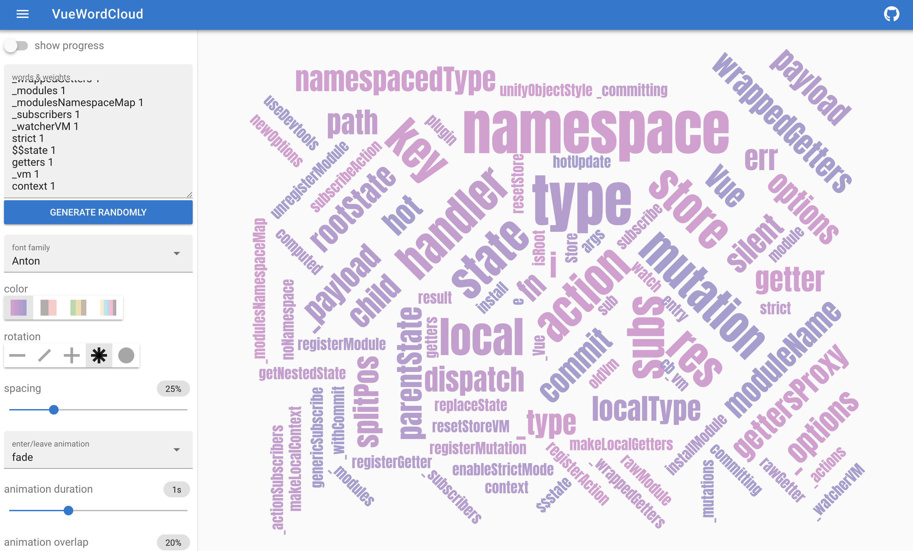

# iroun
A JavaScript-based name analyzer for all javascript developers in the world.

## Installation

    npm install iroun

## Usage
### Usage library
```js
const { extract } = require('iroun')

const names = extract(`${path}`)  // javascript file path
console.log(JSON.stringify(names, null, 2))
```
```json
output is
{
   "classNames":{
      "Store":1
   },
   "methodNames":{
      "commit":1,
      "dispatch":1,
      "subscribe":1,
      ...
   },
   "variableNames":{
      "Vue":1,
      "store":1,
      "state":2,
      ...
   },
   "parameterNames":{
      "plugin":1,
      "sub":5,
      "handler":3,
      ...
   },
   "argumentNames":{
      "Vue":2,
      "store":14,
      "type":6,
      ...
   },
   "attributeNames":{
      "_committing":3,
      "_actions":2,
      "_actionSubscribers":1,
      ...
   }
}
```

### Making the word cloud
> This is sample code for a single Javascript file.
> You can extract the names of all your project files and create word clouds!

```js
const { extract } = require('iroun')

const names = extract(`${path}`)  // javascript file path

const nameAndFrequency = Object.create(null)
const updateName = function (name) {
  nameAndFrequency[name] = (nameAndFrequency[name] || 0) + 1;
};

for (let kind in names) {
  for (let name in names[kind]) {
    updateName(name)
  }
}

const list = []
for (let name in nameAndFrequency) {
  list.push(`${name} ${nameAndFrequency[name]}`)
}
console.log(list.join('\n'))
// Output is ...
// Store 1
// commit 2
// dispatch 2
// subscribe 1
// subscribeAction 1
// watch 1
// replaceState 1
// registerModule 1
// unregisterModule 1
// hotUpdate 1
// _withCommit 1
```

Using [VueWordCloud](https://seregpie.github.io/VueWordCloud/) created by [SeregPie](https://github.com/SeregPie), you can create a word-cloud.
Copy and paste the output.



## License

  MIT