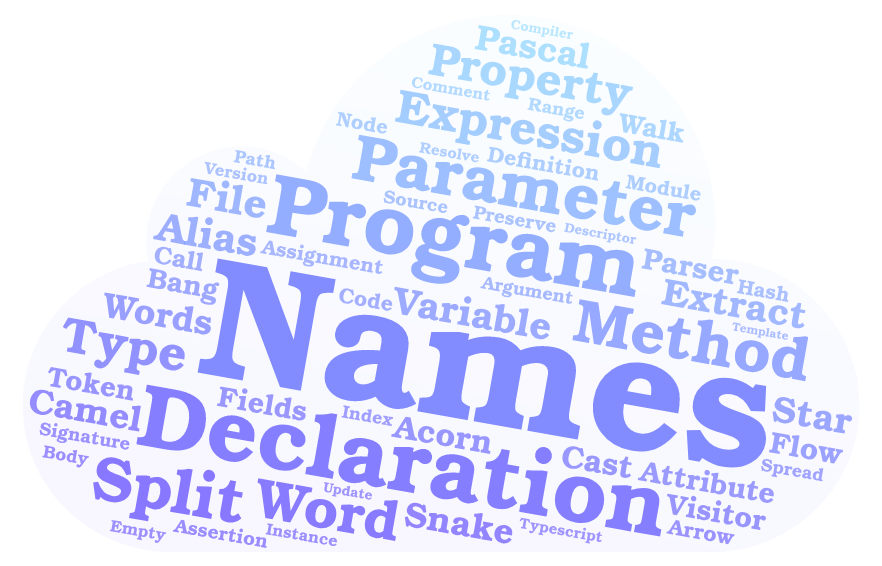

# iroun
[](https://www.npmjs.com/package/iroun)
[](https://www.npmjs.com/package/iroun)
[](https://github.com/pistis/iroun/blob/master/LICENSE)

A JavaScript-based name analyzer for all javascript developers in the world.  



## Why is it fun?

Topic Word  
1. It is easy to see which words I use a lot in my Javascript project and whether they are really characteristic words that can represent my project.  
2. You can easily identify the characteristic words of well-made open source projects as well as my project.  
3. Provides output to create a cool word cloud image.  

## Installation
```bash
$ npm install -g iroun
```

## Usage
### Features
#### 1. Analyze Topic Word
> With the help of 'iroun' you can make a nice word cloud in wordart.

**Topic word extraction algorithm**  

*Word extraction (This process is performed on about 100 github open source.)*
1. After parsing all the js, vue, and ts files in the project, create an AST.
2. Extract the names of Class, Method, Variable, Parameter, Argument, and Attribute from AST.
3. Separate words from names (camelCase, PascalCase, snake_case, etc ...)
4. Filter out words whose pos(parts of speech) are nouns.
5. Filter the stopwords. (english stopwords, javascript reserved keywords)
6. Save the resulting words into a text file with a space separator.

*Topic word selection*
1. Extract feature words by applying word frequency and TF-IDF text mining algorithm based on extracted word text data.
2. Save the feature word as a text file.

##### How to
```bash
$ iroun -n "your project name" -s "your project source root directory path" -o "your output directory path"
or
$ iroun -n "your project name" -r "public git repository url" -o "your output directory path"
```

##### Output Examples
Word Clouds
> It is made up of words and weights that mean weights.  
> You just copy this text and paste it at [wordclouds.com](https://www.wordclouds.com/).  

```
$ open /{your output path}/topic-{project name}-word-for-wordclouds.com.txt
40 names
23 declaration
21 program
18 parameter
16 expression
16 split
12 method
12 property
11 word
10 variable
...
```

Word Art
> It is a text file in which the word is repeated as much as the weight.  
> You just copy and paste this text into [wordart.com](https://wordart.com/).  

```bash
$ open /{your output path}/topic-{project name}-word-for-wordart.com.txt
names names names names names names names names names names names names names names names names names names names names names names names names names names names names names names names names names names names names names names names names declaration declaration declaration declaration declaration declaration declaration declaration declaration declaration declaration declaration declaration declaration declaration declaration declaration declaration declaration declaration declaration declaration declaration program program program program program program program program program program program program program program program program program program program .....
```

## CONTRIBUTING
The project is still in its infancy and we are constantly wondering what meaningful information we can get by analyzing well-crafted open source projects.  
If have any ideas, please feel free to register issue.  

## License

  MIT
